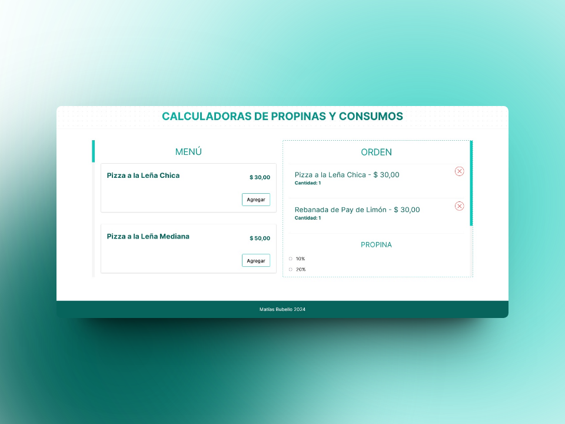

# 🧮 Calculadora de Pedidos 🧮

¡Bienvenido a la Calculadora de Pedidos! 🎉 Este proyecto es una aplicación web desarrollada con React, Vite y TypeScript que te permite crear órdenes de menú personalizadas y calcular el total, incluyendo el porcentaje de propina.

## ¿Cómo funciona?

1. **Agregar ítems al pedido:** Selecciona los elementos del menú que desees agregar a tu orden y asigna la cantidad deseada.
2. **Calcular el total:** Ingresa el porcentaje de propina que deseas dejar y la calculadora mostrará el subtotal, el monto de propina y el total final de la orden.
3. **Visualización clara:** La interfaz intuitiva te permite ver rápidamente los detalles de tu pedido y realizar ajustes según sea necesario.

### Capturas de pantalla

 

### Instalación

1. Clona este repositorio en tu máquina local.
2. Instala las dependencias utilizando <code>npm install</code>:
3. Ejecuta la aplicación en tu entorno de desarrollo: <code>npm run dev</code>
4. Haz la build con <code>npm run build</code>
5. Mira la preview con <code>npm run preview</code>

## Contribución

¡Las contribuciones son bienvenidas! Si deseas mejorar esta calculadora de pedidos, sigue estos pasos:

1. Haz un fork de este repositorio.
2. Crea una rama con tu nueva característica (<code>git checkout -b feature/AmazingFeature</code>).
3. Realiza tus cambios y haz commit de ellos (<code>git commit -m 'Agrega una característica increíble'</code>).
4. Haz push a la rama (<code>git push origin feature/AmazingFeature</code>).
5. Abre un Pull Request.

## Stack

#### Licencia

Distribuido bajo la licencia MIT. Consulte [LICENCIA](https://github.com/MattEzekiel/Calculadora-Propinas/blob/master/LICENSE) para obtener más información.
